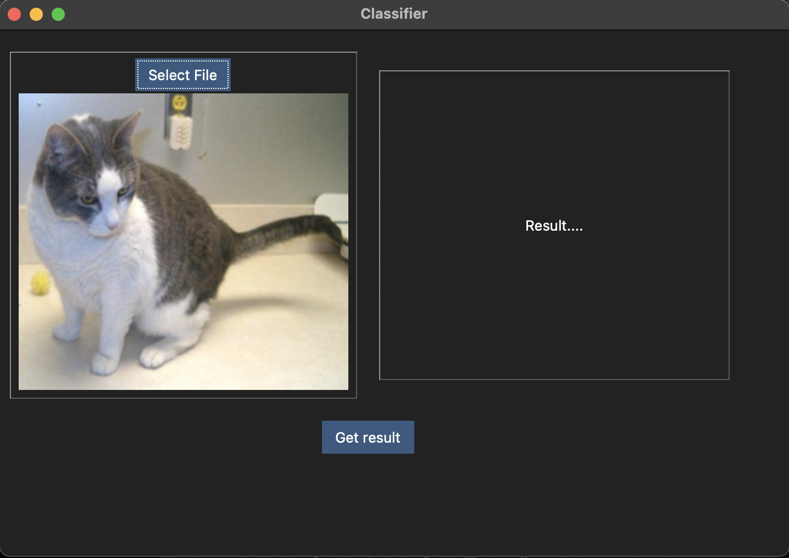
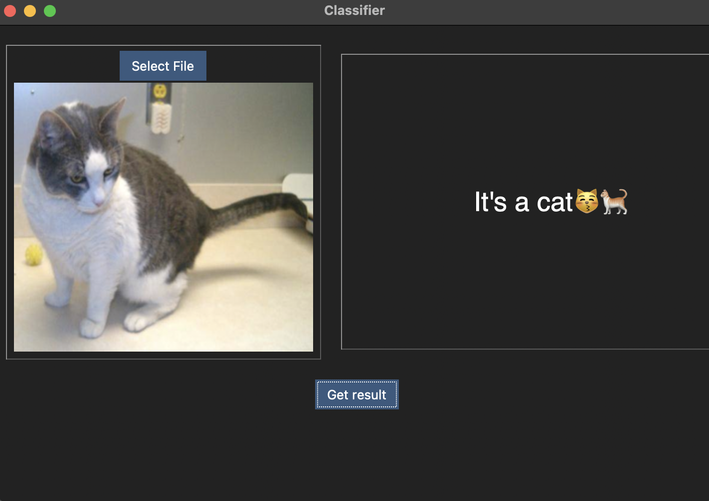

# Cat-and-dog-classifier
This is a simple cat and dog classifier that uses tensorflow and tkinter modules. I have used EfficientNetB0 model and have fine-tuned it. I have also applied data augmentaion techniques. I believe this model is an overkill for such a simple classifer but I just wanted to test my knowledge. This model is supposedly about 99% accurate.

All you need is to install the requirements using the command: `pip install -r requirements.txt`. Then you run the classifier using the command `python main.py`

